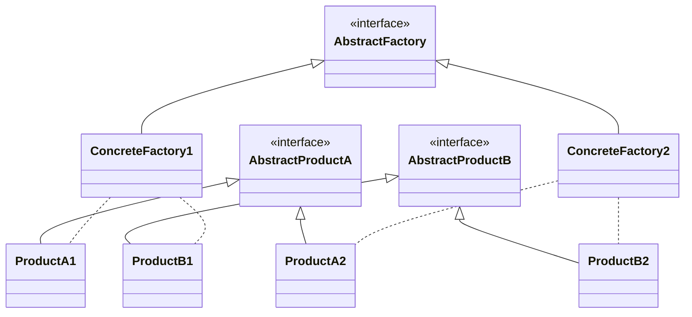

The AbstractFactory pattern is a pattern for generating a set of objects that\
require consistency without error by preparing a class that specializes in
instance generation.

```mermaid
classDiagram

class AbstractFactory {
    <<interface>>
}
AbstractFactory <|-- ConcreteFactory1

class AbstractFactory {
    <<interface>>
}
AbstractFactory <|-- ConcreteFactory2

class AbstractProductA {
    <<interface>>
}
AbstractProductA <|-- ProductA1
AbstractProductA <|-- ProductA2

class AbstractProductB {
    <<interface>>
}
AbstractProductB <|-- ProductB1
AbstractProductB <|-- ProductB2


ConcreteFactory1 .. ProductA1
ConcreteFactory1 .. ProductB1

ConcreteFactory2 .. ProductA2
ConcreteFactory2 .. ProductB2
```
