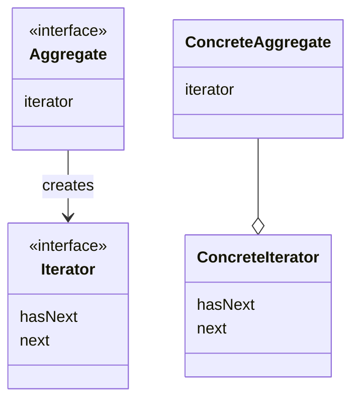

```mermaid
classDiagram
class Aggregate {
  <<interface>>
  iterator
}

class Iterator {
  <<interface>>
  hasNext
  next
}

Aggregate --> Iterator : creates


class ConcreteAggregate {
  iterator
}

class ConcreteIterator {
  hasNext
  next
}

ConcreteAggregate --o ConcreteIterator

```