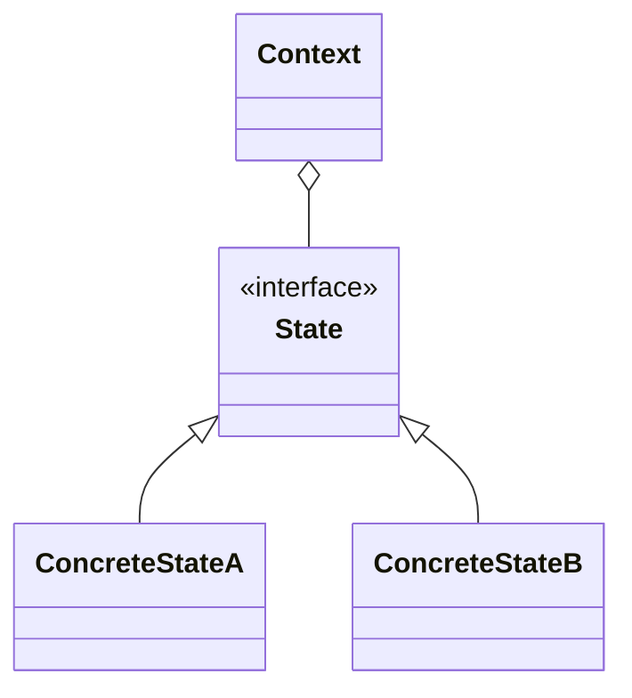

# State Pattern

A kind of design pattern for behavior. Explain state as a class.

```mermaid
classDiagram

class State {
    <<interface>>
}
Context o-- State
State <|-- ConcreteStateA
State <|-- ConcreteStateB
```

ConcreteStateA and ConcreteStateB are Singleton. State class has methods for
changing states.
